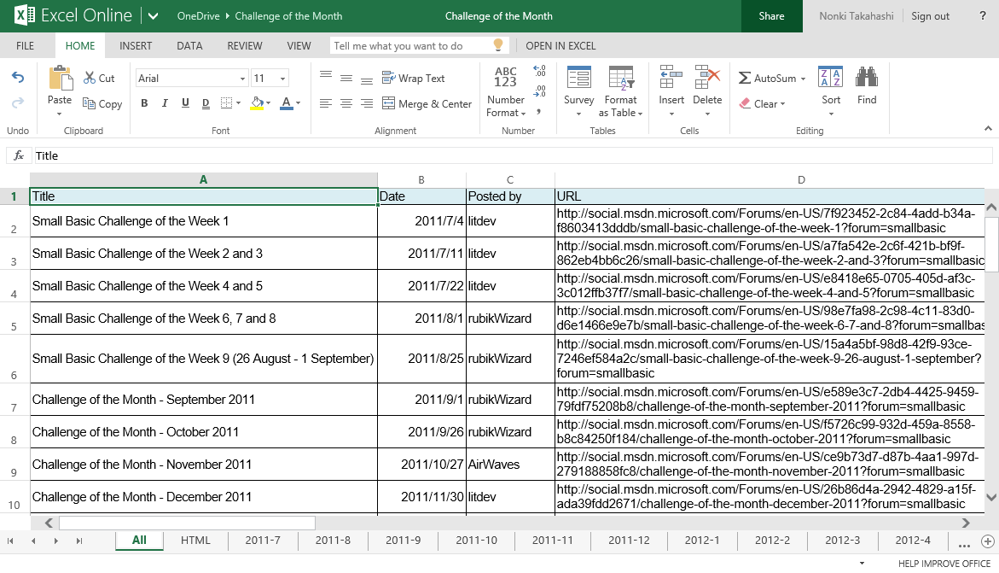
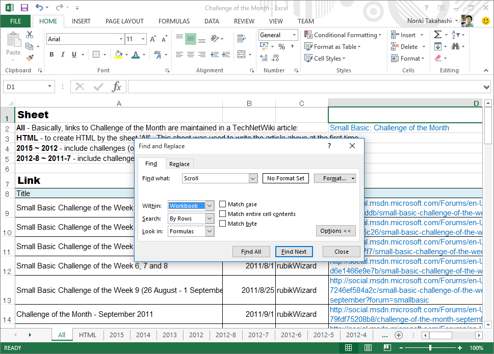

# Small Basic: Challenge of the Month: Excel Workbook
This is an Excel workbook which contaiins a table of all past Small Basic Challenge of the Month. Challenge of the Month is started in 2011 to present challenges for Small Basic programmers. Microsoft Small Basic is a simple progamming language for people who learn programming.

***Download***: [Challenge of the Month.xlsx](https://github.com/nonkit/SBResources/raw/master/challenge/Challenge%20of%20the%20Month.xlsx)

- Downloaded: 3,103 times
- Category: Office
- Sub-category: Microsoft Excel
- Tags: Excel, HTML, Small Basic, Monthly Challenge, Small Basic Spreadsheets
- Updated: 3/2/2020
- License: [MIT](/LICENSE)

## Description
### About the workbook Challenge of the Month.xlsx

This Excel workbook contains a table of all past Challenge of the Month in Small Basic Forum.  Challenge of the Month is started on July 4, 2011 to present challenges for Small Basic programmers.  Microsoft Small Basic is a simple programming language for users who learn programming.  Challenge of the Month project is contributing to create a lot of great challenges and sample codes for Small Basic users.

Sheet All is the original table which has items challenge title, posted date, posted by, and URL to the challenge.

Sheet HTML is a sample to create HTML table tag from Excel sheet.  Generated HTML is actually used in a TechNet Wiki article:
Small Basic: Challenge of the Month
http://social.technet.microsoft.com/wiki/contents/articles/24745.small-basic-challenge-of-the-month.aspx

Other sheets contain the detail of each challenge.  I've not created the detail sheets for September 2012 and after that.  But table in sheet All contains all challenges until June 2014.
Uploaded file archive.zip contains following MPEG-4 audio files.

### Updated on November 14, 2015

- Added links until October/November 2015 in sheet 'All'.
- Added four sheets '2015', '2014', '2013' and '2012' containing challenges text after September 2012.

### Updated on November 21, 2015

- Corrected a link in sheet 'All'.
- Added challenges text in sheet '2014' and '2013'.  So all texts in the Challenge of the Month are included in this workbook.  You can use \[Editing\] \[Find and Replace\] \[Options\] \[Within Workbook\] to find keyword through this workbook.

### Updated on April 3, 2016

- Added challenges in sheets '2015' and '2016'.

### Updated on July 29, 2016

- Added challenges in sheet '2016'.

### Updated on January 3, 2017

- Added challenges in sheet '2016' and '2017'.

### Updated on April 9, 2017

- Added challenges in sheet '2017'.

### Updated on February 2, 2019

- Added challenges in sheet '2017' and '2018'.

### Updated on March 1, 2020

- Added challenges in sheet '2019'.
 

### About author

This workbook has been created by Nonki Takahashi who is a member of Small Basic Communication Counsil.

***Verified on the following platforms***

| Platform | Verified |
| --- | --- |
| Windows 10 | Yes |
| Windows Server 2012 | Yes |
| Windows Server 2012 R2 | No |
| Windows Server 2008 R2 | Yes |
| Windows Server 2008 | Yes |
| Windows Server 2003 | Yes |
| Windows Server 2016 | No |
| Windows 8 | Yes |
| Windows 7 | Yes |
| Windows Vista | Yes |
| Windows XP | Yes |
| Windows 2000 | Yes |
