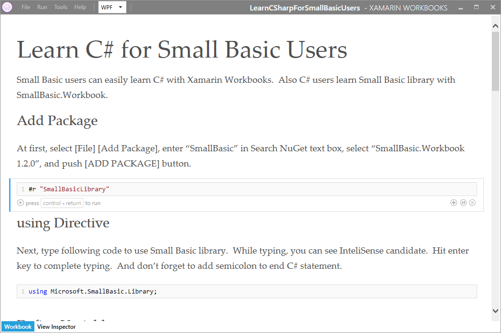
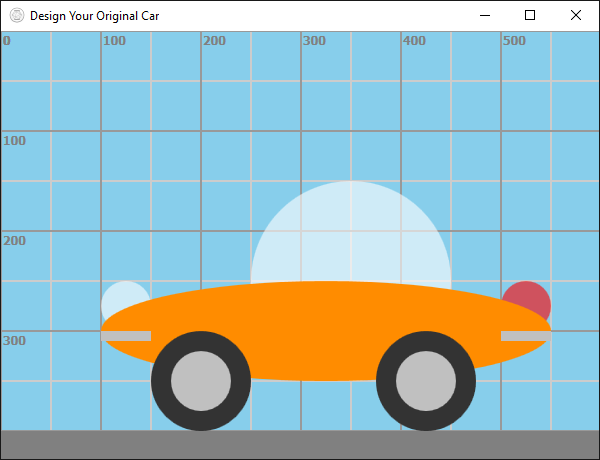

# Xamarin Workbook: Learn C# for Small Basic Users
This is a Xamarin Workbook to learn C# for Small Basic users.  Xamarin Workbook contains markdown text and C# code.  With Xamarin Workbooks application, you can run the code in the workbook.This workbook has a C# program converted from a Small Basic program.  So, the program is v

**Download**: [LearnCSharpForSmallBasicUsers.workbook](https://github.com/nonkit/SBResources/raw/master/csharp/LearnCSharpForSmallBasicUsers.workbook)

- Downloaded: 410 times
- Category: Applications
- Sub-category: Client Applications
- Tags: C#, Small Basic, Xamarin Workbooks
- Updated: 9/12/2017
- License: [MIT](/LICENSE)

## Description
This is a Xamarin Workbook to learn C# for Small Basic users.  Xamarin Workbook contains markdown text and C# code.  With Xamarin Workbooks application, you can run the code in the workbook.

This workbook has a C# program converted from a Small Basic program.  So, the program is very similar to the Small Basic program.  Small Basic user can learn C# with this kind of workbooks.  So, this is a sample to learn some manner in C# such like semicolon and for statement.

And also, C# users can learn about Small Basic because this program calls Small Basic library.

## See Also
- [Small Basic with Xamarin Workbooks](https://techcommunity.microsoft.com/t5/small-basic-blog/small-basic-with-xamarin-workbooks/ba-p/338130) (blog)

**Verified on the following platforms**

| Platform | Verified |
| --- | --- |
| Windows 10 | Yes |
| Windows Server 2012 | No |
| Windows Server 2012 R2 | No |
| Windows Server 2008 R2 | No |
| Windows Server 2008 | No |
| Windows Server 2003 | No |
| Windows Server 2016 | No |
| Windows 8 | No |
| Windows 7 | No |
| Windows Vista | No |
| Windows XP | No |
| Windows 2000 | No |

This script is tested on these platforms by the author. It is likely to work on other platforms as well. If you try it and find that it works on another platform, please add a note to the script discussion to let others know.