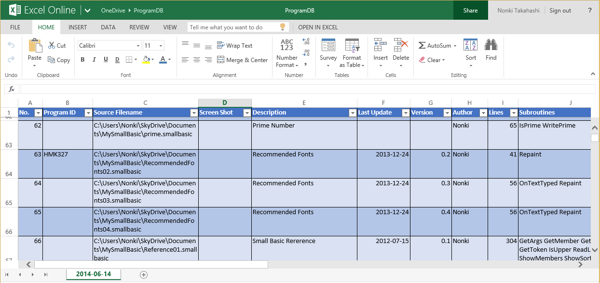

# Small Basic: Sample Output of Program Database: Excel Workbook
I'm making a Program Database in Small Basic programming language.  The article for this program is here in Small Basic Forum.  And this Excel sheet is created by a Program Database tool as a CSV file.  And updated with Excel.  This sheet contains my Small Basic programs with

**Download**: [ProgramDB.xlsx](https://github.com/nonkit/SBResources/raw/master/db/ProgramDB.xlsx)

- Downloaded: 1,278 times
- Category: Office
- Sub-category: Microsoft Excel
- Tags: Excel, Small Basic, Small Basic Spreadsheets
- Updated: 11/21/2015
- License: [MIT](/LICENSE)

## Description
I'm making a Program Database in Small Basic programming language.  The article for this program is here in Small Basic Forum.  And this Excel sheet is created by a Program Database tool as a CSV file.  And updated with Excel.  This sheet contains my Small Basic programs with following information.

- Program ID
- Source Filename
- Screen Shot (N/A)
- Description
- Last Update
- Version
- Author
- Lines
- Subroutines
- Challenge

At this point, this sheet contains 474 programs on my OneDrive.

**Verified on the following platforms**

| Platform | Verified |
| --- | --- |
| Windows 10 | Yes |
| Windows Server 2012 | Yes |
| Windows Server 2012 R2 | No |
| Windows Server 2008 R2 | Yes |
| Windows Server 2008 | Yes |
| Windows Server 2003 | Yes |
| Windows Server 2016 | No |
| Windows 8 | Yes |
| Windows 7 | Yes |
| Windows Vista | Yes |
| Windows XP | Yes |
| Windows 2000 | Yes |

