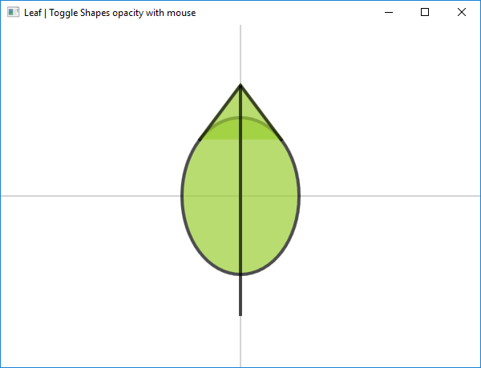

# Microsoft Small Basic で図形を描く A-Z ノート
このノートは Microsoft Small Basic の Shapes オブジェクト（長方形、楕円、三角形と直線）を使ってどのように様々な図形を描くかについて説明しています。描かれた図形は移動、拡大縮小、回転、反転することができます。図形を反転できるように、三角形は二等辺三角形を使います。

**ダウンロード**: [Drawing Shapes Notebook 0.21.pdf](https://github.com/nonkit/SBResources/raw/master/draw/Drawing%20Shapes%20Notebook%200.21.pdf)

- ダウンロード済み: 91 times
- カテゴリ: アプリケーション
- サブカテゴリ: クライアント アプリケーション
- 翻訳: [English](README.md)
- タグ: Small Basic
- 最終更新日: 2019/10/27
- ライセンス: [MIT](/LICENSE)

## 説明

このノートは Microsoft Small Basic の Shapes オブジェクト（長方形、楕円、三角形と直線）を使ってどのように様々な図形を描くかについて説明しています。描かれた図形は移動、拡大縮小、回転、反転することができます。図形を反転できるように、三角形は二等辺三角形を使います。

現在のバーション(v0.21)は以下の図形を含みます。

A. 円をつなぐ 
B. 角丸三角形 
C. 葉っぱ 
D. 台形 
E. 平行四辺形 
F. 六角形 
G. 円弧 
H. 角丸四角形 
I. 筍形（たけのこがた）

それぞれの図形には [SWQ334](http://smallbasic.com/program/?SWQ334) のようなサンプルプログラムがあります。

このギャラリーで公開しているのは英語ですが、日本語のリソースとして以下もご覧ください。

- [Small Basic Fun Japan ノート](https://www.facebook.com/pg/SmallBasicFunJapan/notes/) (Facebook)

**次のプラットフォームで検証済み**

| プラットフォームウ | 結果 |
| --- | --- |
| Windows 10 | 適 |
| Windows Server 2012 | 不適 |
| Windows Server 2012 R2 | 不適 |
| Windows Server 2008 R2 | 不適 |
| Windows Server 2008 | 不適 |
| Windows Server 2003 | 不適 |
| Windows Server 2016 | 不適 |
| Windows 8 | 不適 |
| Windows 7 | 不適 |
| Windows Vista | 不適 |
| Windows XP | 不適 |
| Windows 2000 | 不適 |
