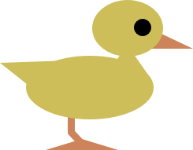
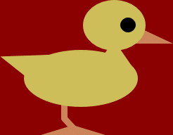

# Small Basic: DuckShoot Images: PowerPoint Macro-Enabled Presentation
This file is a Microsoft PowerPoint Macro-Enabled Presentation.  Following three image files are created from this presentation by \[Save as Picture\] option.Duck.png with transparent background color.Duck2.png with opaque background color.Sighter.png with transparent background co

**Download**: [DuckShoot.ppm](https://github.com/nonkit/SBResources/raw/master/duck/DuckShoot.pptm)

- Downloaded: 550 times
- Category: Office
- Sub-category: Microsoft PowerPoint
- Tags: PowerPoint presentation, Small Basic, Small Basic Deck
- Updated: 11/21/2015
- License: [MIT](/LICENSE)

## Description
This file is a Microsoft PowerPoint Macro-Enabled Presentation.  Following three image files are created from this presentation by [Save as Picture] option.

[Duck.png](https://github.com/nonkit/SBResources/raw/master/duck/Duck.png) with transparent background color.

[Duck2.png](https://github.com/nonkit/SBResources/raw/master/duck/Duck2.png) with opaque background color.

[Sighter.png](https://github.com/nonkit/SBResources/raw/master/duck/Sighter.png) with transparent background color.

Original source of these images is DuckShoot 0.1 ([TLR995](http://smallbasic.com/program/?TLR995)).  This program has two subroutines Shapes_Init() and Sighter_Init() that are created with Shapes editor 1.5b ([XFZ657-15](http://smallbasic.com/program/?XFZ657-15)).

And these subroutines are comverted to PowerPoint macros with a tool Converter from Shapes to PowerPoint VBA 0.1 ([XQD349](http://smallbasic.com/program/?XQD349)).

### See Also
- [Shapes Editor for Small Basic](https://social.msdn.microsoft.com/Forums/en-US/b03e6721-2b9b-4e10-9056-4d434023c27e/shapes-editor-for-small-basic)  (an article in Small Basic Forum)
- [Shapes Editor - Small Basic Featured Program](https://techcommunity.microsoft.com/t5/small-basic-blog/shapes-editor-small-basic-featured-program/ba-p/335819)  (an article in official Small Basic Blog)
- [Small Basic and Office Suite](https://techcommunity.microsoft.com/t5/small-basic-blog/small-basic-and-office-suite/ba-p/336657)  (an article in official Small Basic Blog)
- [How do you get an image for your program?](https://techcommunity.microsoft.com/t5/small-basic-blog/how-do-you-get-an-image-for-your-program/ba-p/336504)  (an article in official Small Basic Blog)
