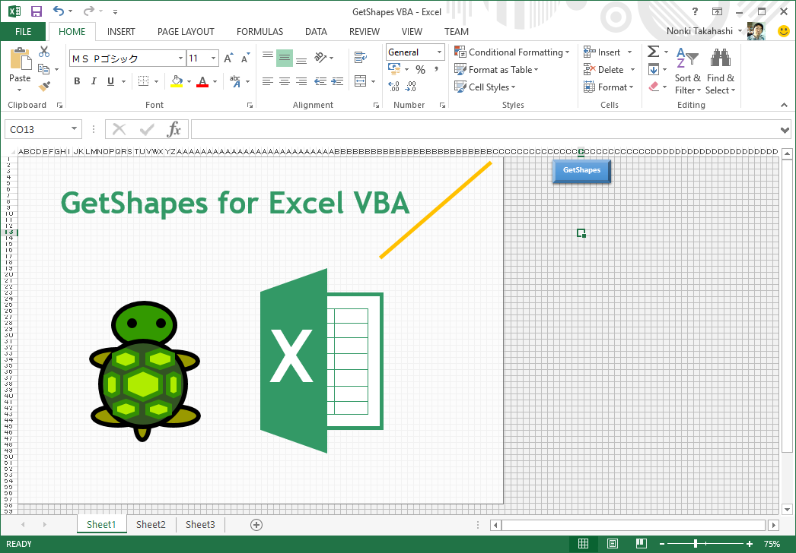
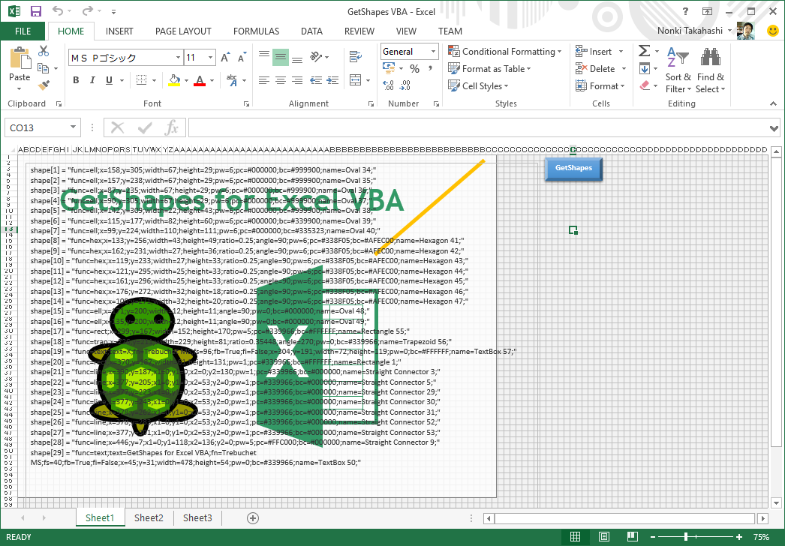
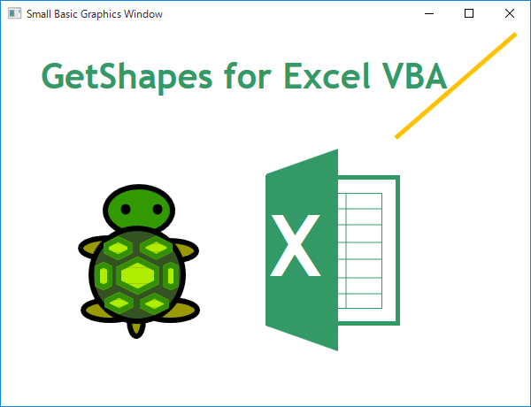

# Small Basic: GetShapes VBA:  Excel Macro-Enabled Workbook
This worksheet has a macro GetShapes to create a code including shape array for Microsoft Small Basic programming language. To run the macro GetShape, push \[GetShaps\] button.  So, you can get a code as a textbox text.This array is treated in Shapes editor.  But there are two virtu

**Download**: [GetShapes VBA.xlsm](https://github.com/nonkit/SBResources/raw/master/excel/GetShapes%20VBA.xlsm)

- Downloaded: 524 times
- Category: Office
- Sub-category: Microsoft Excel
- Tags: Excel, Small Basic, Small Basic Spreadsheets
- Updated: 11/2/2015
- License: [MIT](/LICENSE)

## Description
This worksheet has a macro *GetShapes* to create a code including *shape array* for Microsoft Small Basic programming language.

To run the macro GetShape, push \[GetShape\] button.  So, you can get a code as a textbox text.

This array is treated in *Shapes* editor.  But there are two virtual functions *trap* (trapezoid) and *hex* (hexagon).

These two virtual functions are converted to *rect* (rectangle), *tri* (triangle) and *line* in this program ([SJG122](http://smallbasic.com/program/?SJG122)).

### Usage
1. Open Sheet3.
2. Draw a picture in the white rectangle with shapes.
3. Push \[GetShapes\] button.
4. Copy generated code and paste to replace *shape* array initial code in Shapes_Init subroutine in SJG122 (above).
5. Modify iMax to the number of elements in new *shape* array.
6. Delete shapes in Sheet3 if needed.  You can select shapes to delete by following sequence.  (1) Select a shape. (2) Select \[DRAWING TOOLS\] \[FORMAT\] \[Arrange\] \[Selection Pane\].  (3) Click shape names with pushing \[Ctrl\] key.  Don't delete last two shapes Bevel and Rectangle.

### Known Issues
- Transparent fill is not supported in this macro.
- Group is not supported.  So, ungroup shapes before running this macro.
- Border of trapezoid runs off at base vertices.
Border of hexagon runs off at side verteces if the angle is smaller than right angle (90 degree).
- Generated code is a part of program.  So, folloing actions are needed for complete program.
  1. Get a shapes program from *Shapes* editor such as SJG122.
  2. Modify Shapes_Init to include generated shape array.
  3. Modify iMax to the number of elements in shape array.

### See Also
- [Small Basic: GetShapes VBA: PowerPoint Macro-Enabled Presentation](https://github.com/nonkit/SBResources/tree/master/ppt)
- [Shape Array Specification](https://github.com/nonkit/Shapes/wiki/Shape-Array-Specification)
- [Shapes](https://nonkit.github.io/Shapes/) editor

**Verified on the following platforms**

| Platform | Verified |
| --- | --- |
| Windows 10 | Yes |
| Windows Server 2012 | Yes |
| Windows Server 2012 R2 | No |
| Windows Server 2008 R2 | Yes |
| Windows Server 2008 | Yes |
| Windows Server 2003 | Yes |
| Windows Server 2016 | No |
| Windows 8 | Yes |
| Windows 7 | Yes |
| Windows Vista | Yes |
| Windows XP | Yes |
| Windows 2000 | Yes |
