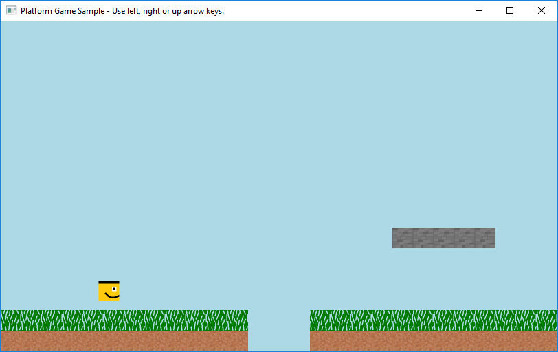

# Small Basic Game: Platform Game Sample
This program is a platform game sample modified for Challenge of the Month - July 2017.System Requirement Microsoft Small Basic 1.2 .NET Framework 4.5 UsageHit left, right or up arrow keys to move the character.FeaturesThis game is compatible with Small Block Builder.CreditsSm

**Download**: [PlatformGame0.5b.zip](https://github.com/nonkit/SBResources/raw/master/game/PlatformGame0.5b.zip)

- Downloaded: 54 times
- Category: Applications
- Sub-category: Client Applications
- Tags: Small Basic, Games, Small Basic Games
- Updated: 7/28/2017
- License: [MIT](/LICENSE)

## Description

This program is a platform game sample modified for [Challenge of the Month - July 2017](https://social.msdn.microsoft.com/Forums/en-US/5adcb28e-2e0e-4b7f-a464-54285d669390/challenge-of-the-month-july-2017?forum=smallbasic&prof=required).

### System Requirement
- Microsoft Small Basic 1.2
- .NET Framework 4.5

### Usage
Hit left, right or up arrow keys to move the character.

### Features
This game is compatible with [Small Block Builder](https://gallery.technet.microsoft.com/Small-Block-Builder-6bdb1c87).

### Credits
Small Block Builder is created by Bluegrams.

CorrisionCheck subroitine is written by litdev.

Platform Game Sample is written by Nonki Takahashi.

**Verified on the following platforms**

| Platform | Verified |
| --- | --- |
| Windows 10 | Yes |
| Windows Server 2012 | Yes |
| Windows Server 2012 R2 | Yes |
| Windows Server 2008 R2 | Yes |
| Windows Server 2008 | Yes |
| Windows Server 2003 | No |
| Windows Server 2016 | No |
| Windows 8 | Yes |
| Windows 7 | Yes |
| Windows Vista | No |
| Windows XP | No |
| Windows 2000 | No |
