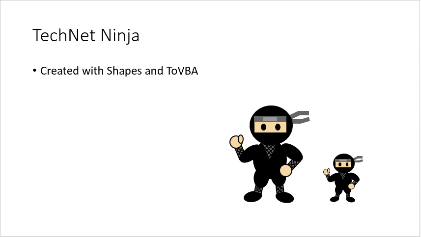
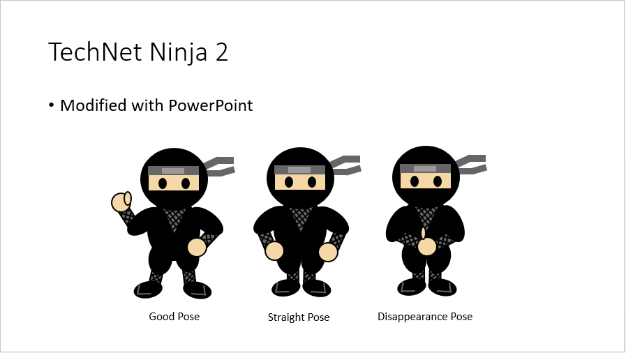

# Images for TechNet Guru Iconography: PowerPoint Presentation
This is a PowerPoint presentation file including my suggestion images for TechNet Guru Inonography.Current version contains only TechNet Ninja images. But, I will update this presentation if new images are available.This image is created with a Small Basic program Shapes.  And

**Download**: [Images for TechNet Guru Iconography.pptx](https://github.com/nonkit/SBResources/raw/master/ninja/Images%20for%20TechNet%20Guru%20Iconography.pptx)

- Downloaded: 559 times
- Category: Office
- Sub-category: Microsoft PowerPoint
- Tags: TechNet Wiki, PowerPoint presentation
- Updated: 2/1/2016
- License: [MIT](/LICENSE)

## Description

This is a PowerPoint presentation file including my suggestion images for TechNet Guru Inonography.

Current version contains only TechNet Ninja images. But, I will update this presentation if new images are available.

This image is created with a Small Basic program Shapes.  And converted to VBA with ToVBA ([XQD349-4](http://smallbasic.com/program/?XQD349-4)).

If you modify the PowerPoint shape, you can convert it to Small Basic code again with GetShapes macro.

### UPDATE 2016-02-01
Medal images and sample banner are added.

# See Also
- [Nonki's Suggestions for TechNet Guru Iconography](http://social.technet.microsoft.com/wiki/contents/articles/33179.nonki-s-suggestions-for-technet-guru-iconography.aspx)

**Verified on the following platforms**

| Platform | Verified |
| --- | --- |
| Windows 10 | Yes |
| Windows Server 2012 | No |
| Windows Server 2012 R2 | No |
| Windows Server 2008 R2 | No |
| Windows Server 2008 | No |
| Windows Server 2003 | No |
| Windows Server 2016 | No |
| Windows 8 | No |
| Windows 7 | No |
| Windows Vista | No |
| Windows XP | No |
| Windows 2000 | No |
