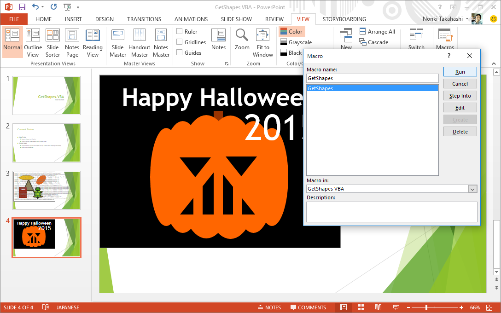
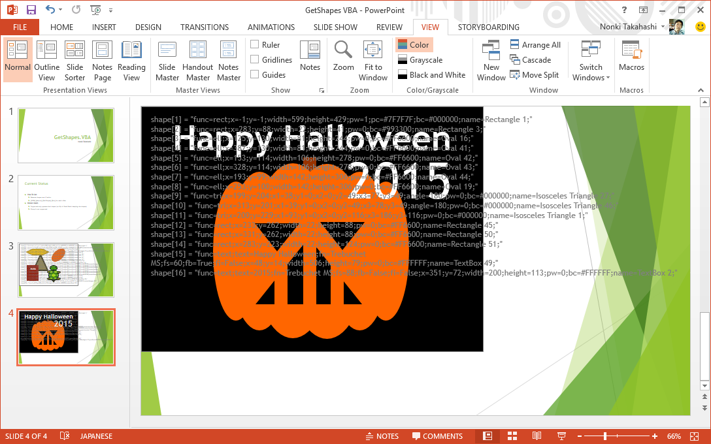
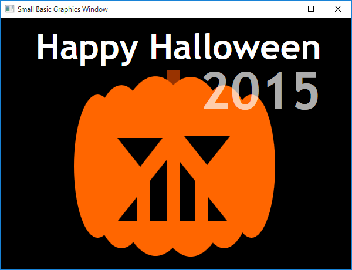

# Small Basic: GetShapes VBA: PowerPoint Macro-Enabled Presentation
This is a PowerPoint macro-enabled presentation to convert Office shapes to Small Basic shapes.Macro GetShapes creates a code containing Small Basic shape array.  This array can be retreaved by such Small Basic program GJB066.Following screen shot is the result with Small Basic (

**Download**: [GetShapes VBA.pptm](https://github.com/nonkit/SBResources/raw/master/ppt/GetShapes%20VBA.pptm)

- Downloaded: 723 times
- Category: Office
- Sub-category: Microsoft PowerPoint
- Tags: PowerPoint presentation, Small Basic, Small Basic Decks
- Updated: 5/20/2019
- License: [MIT](/LICENSE)

## Description

This is a PowerPoint macro-enabled presentation to convert Office shapes to Small Basic shapes.

Macro *GetShapes* creates a code containing Small Basic *shape* array.  This array can be retreaved by such Small Basic program [GJB066](http://smallbasic.com/program/?GJB066).

Following screen shot is the result with Small Basic (GJB066).

Shape array is [defined](https://github.com/nonkit/Shapes/wiki/Shape-Array-Specification) for some Small Basic programs such as [Shapes](https://github.com/nonkit/Shapes) or [Small Wiki Pad](https://github.com/nonkit/SmallWikiPad).

Supported shapes are listed here.

- rectangle
- ellipse
- triangle
- line
- trapezoid (virtual shape)
- hexagon (virtual shape)

Virtual shapes can be converted with a sample [SJG122](http://smallbasic.com/program/?SJG122).

### UPDATE on 2016-01-08
- Line supported.

### See Also
- [Small Basic Shapes from Microsoft Office](https://techcommunity.microsoft.com/t5/Small-Basic-Blog/Small-Basic-Shapes-from-Microsoft-Office/ba-p/337573) (blog)
- [PowerPoint VBA - GetShapes Macro](https://github.com/nonkit/Shapes/wiki/PowerPoint-VBA-%E2%80%94-GetShapes-Macro) (GitHub wiki)

**Verified on the following platforms**

| Platform | Verified |
| --- | --- |
| Windows 10 | Yes |
| Windows Server 2012 | Yes |
| Windows Server 2012 R2 | No |
| Windows Server 2008 R2 | Yes |
| Windows Server 2008 | Yes |
| Windows Server 2003 | Yes |
| Windows Server 2016 | No |
| Windows 8 | Yes |
| Windows 7 | Yes |
| Windows Vista | Yes |
| Windows XP | Yes |
| Windows 2000 | Yes |
