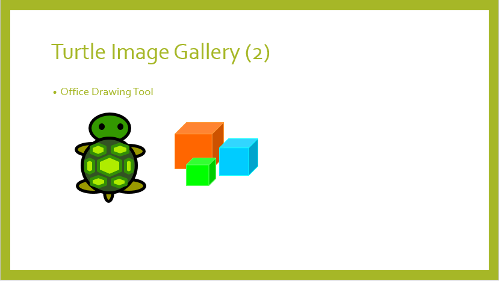
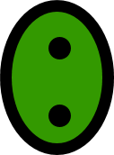
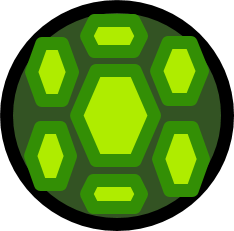
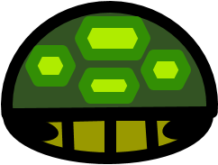
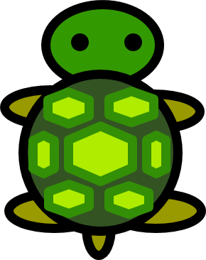
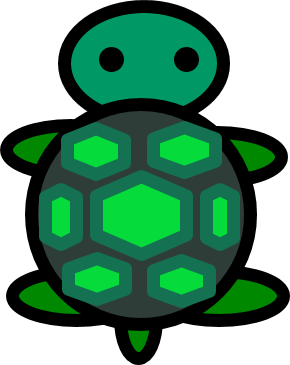
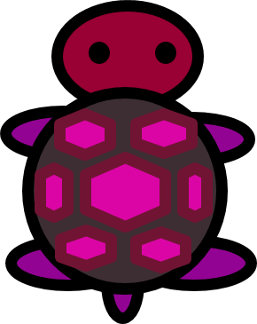

# Small Basic: Another Turtle Project: PowerPoint Presentation
This is a PowerPoint deck for Small Basic Another Turtle Project.  Another Turtle Project is described at here in Small Basic Forum.  I'd like to create many Small Basic programs with Turtle object of Microsoft Small Basic program language.  I will update this deck especially

**Download**: [Another Turtle.pptx](https://github.com/nonkit/SBResources/raw/master/turtle2/Challenge%20of%20the%20Month.xlsx)

- Downloaded: 901 times
- Category: Office
- Sub-category: Microsoft PowerPoint
- Tags: PowerPoint presentation, Small Basic, Small Basic Decks
- Updated: 11/21/2015
- License: [MIT](/LICENSE)

## Description

This is a PowerPoint deck for Small Basic Another Turtle Project.  Another Turtle Project is described at [here](https://social.msdn.microsoft.com/Forums/en-US/4d730151-8ecb-493e-9c76-8bede94e3cf0/another-turtle-graphics?forum=smallbasic) in Small Basic Forum.  I'd like to create many Small Basic programs with Turtle object of Microsoft Small Basic program language.  I will update this deck especially to create Turtle images for the programs.  Following list shows the contents of this deck.

On September 15, 2014, I added following pictures in this deck.

http://i1.gallery.technet.s-msft.com/office/small-basic-deck-another-2f724b78/image/file/125425/1/ftheadb.png

http://i1.gallery.technet.s-msft.com/office/small-basic-deck-another-2f724b78/image/file/125426/1/ftbackb.png

http://i1.gallery.technet.s-msft.com/office/small-basic-deck-another-2f724b78/image/file/125427/1/ftleg.png

http://i1.gallery.technet.s-msft.com/office/small-basic-deck-another-2f724b78/image/file/125428/1/fttail.png

http://i1.gallery.technet.s-msft.com/office/small-basic-deck-another-2f724b78/image/file/125429/1/ftheadr.png

http://i1.gallery.technet.s-msft.com/office/small-basic-deck-another-2f724b78/image/file/125430/1/ftbackr.png

On September 18, 2014, I added following (half size) bitmaps here.

http://i1.gallery.technet.s-msft.com/small-basic-deck-another-2f724b78/image/file/125632/1/ftheadb.png

http://i1.gallery.technet.s-msft.com/small-basic-deck-another-2f724b78/image/file/125633/1/ftbackb.png

http://i1.gallery.technet.s-msft.com/small-basic-deck-another-2f724b78/image/file/125624/1/ftleg.png

http://i1.gallery.technet.s-msft.com/small-basic-deck-another-2f724b78/image/file/125634/1/fttail.png

http://i1.gallery.technet.s-msft.com/small-basic-deck-another-2f724b78/image/file/125635/1/ftheadr.png

http://i1.gallery.technet.s-msft.com/small-basic-deck-another-2f724b78/image/file/125636/1/ftbackr.png

On January 10, 2015, I added following turtles.

http://i1.gallery.technet.s-msft.com/small-basic-deck-another-2f724b78/image/file/132269/1/forestturtle.png

http://i1.gallery.technet.s-msft.com/small-basic-deck-another-2f724b78/image/file/132270/1/tealtrutle.png

http://i1.gallery.technet.s-msft.com/small-basic-deck-another-2f724b78/image/file/132271/1/wineturtle.png

**Verified on the following platforms**

| Platform | Verified |
| --- | --- |
| Windows 10 | Yes |
| Windows Server 2012 | Yes |
| Windows Server 2012 R2 | No |
| Windows Server 2008 R2 | Yes |
| Windows Server 2008 | Yes |
| Windows Server 2003 | Yes |
| Windows Server 2016 | No |
| Windows 8 | Yes |
| Windows 7 | Yes |
| Windows Vista | Yes |
| Windows XP | Yes |
| Windows 2000 | Yes |
