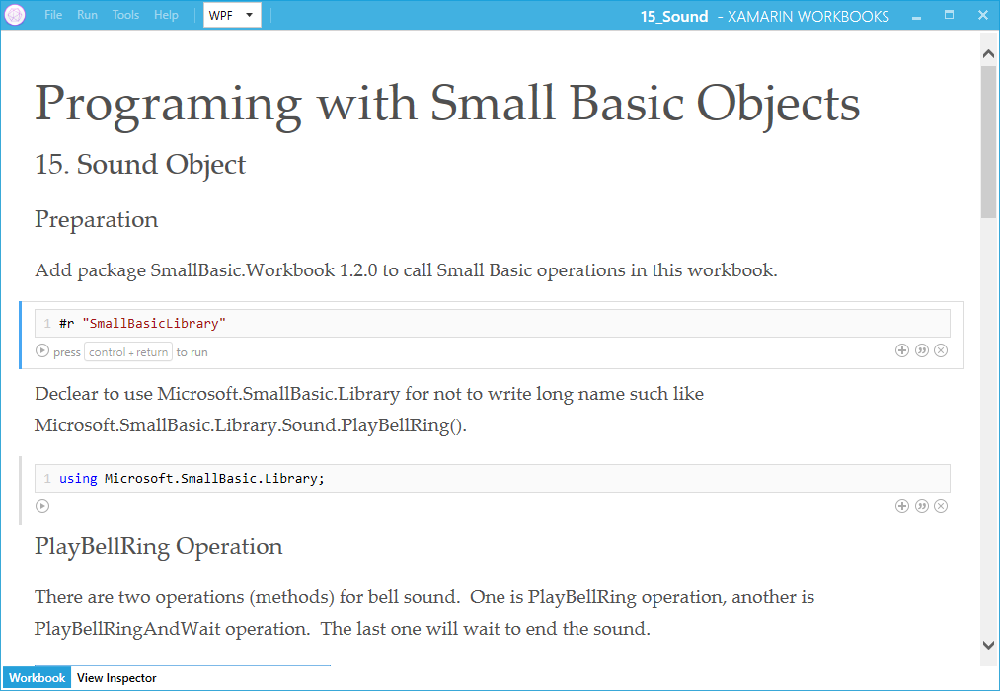

# Xamarin Workbooks: Programing with Small Basic Objects
This zip file will contain 20 workbook folders to learn Small Basic Objects with Xamarin Workbooks.  Currently there are only 4 objects.  These workbooks will cover usage (as sample code) for 20 Small Basic objects. Some workbooks are available for both Mac and Windows.  Some wor

**Download**: [Workbooks.zip](https://github.com/nonkit/SBResources/raw/master/xamarin/Workbooks.zip)

- Downloaded: 59 times
- Category: Applications
- Sub-category: Client Applications
- Translated in: [日本語](READMEJ)
- Tags: C#, Small Basic, Xamarin Workbooks
- Updated: 9/27/2017
- License: [MIT](/LICENSE)

## Description
This zip file will contain 20 workbook folders to learn Small Basic Objects with Xamarin Workbooks.  Currently there are only 4 objects.  These workbooks will cover usage (as sample code) for 20 Small Basic objects. 

Some workbooks are available for both Mac and Windows.  Some workbooks are available only for Windows.

## Usage
1. Install [Xamarin Workbooks](https://developer.xamarin.com/workbooks/).
2. Download Workbooks.zip here.
3. Unzip Workbooks.zip.
4. Run Xamarin Workbooks.
5. Open unzipped workbook folder.

## Availability

| # | Object | Mac | Windows |
| --- | --- | --- | --- |
| 1 | Array | ✔ | ✔ |
| 2 | Clock | ✔ | ✔ |
| 3 | Controls |  | ✔ |
| 4 | Desktop |  |  |
| 5 | Dictionary |  |
| 6 | File |  |  |
| 7 | Flickr |  |  |
| 8 | GraphicsWindow |  |  |
| 9 | ImageList |  |  |
| 10 | Math |  |  |
| 11 | Mouse |  |  |
| 12 | NetWork |  |  |
| 13 | Program |  |  |
| 14 | Shapes |  |  |
| 15 | Sound |  | ✔ |
| 16 | Stack | ✔ | ✔ |
| 17 | Text |  |  |
| 18 | TextWindow |  |  |
| 19 | Timer |  | ✔ |
| 20 | Turtle |  |  |

## Known Issues
1. Sound.PlayXXX() method sometimes make other method's sound in Xamarin Workbooks.
2. Document below a horizontal rule will disapear after save with Xamarin Workbooks.

## See Also
- [Small Basic: Sample Code](https://social.technet.microsoft.com/wiki/contents/articles/34917.small-basic-sample-code.aspx) (TechNet Wiki)
- [SmallBasic.Workbook 1.2.0: Known Issues](https://social.technet.microsoft.com/wiki/contents/articles/40092.smallbasic-workbook-1-2-0-known-issues.aspx) (TechNet Wiki)
- [nonkit/Workbooks](https://github.com/nonkit/Workbooks) (GitHub)

**Verified on the following platforms**

| Platform | Verified |
| --- | --- |
| Windows 10 | Yes |
| Windows Server 2012 | No |
| Windows Server 2012 R2 | No |
| Windows Server 2008 R2 | No |
| Windows Server 2008 | No |
| Windows Server 2003 | No |
| Windows Server 2016 | No |
| Windows 8 | No |
| Windows 7 | No |
| Windows Vista | No |
| Windows XP | No |
| Windows 2000 | No |

This script is tested on these platforms by the author. It is likely to work on other platforms as well. If you try it and find that it works on another platform, please add a note to the script discussion to let others know.