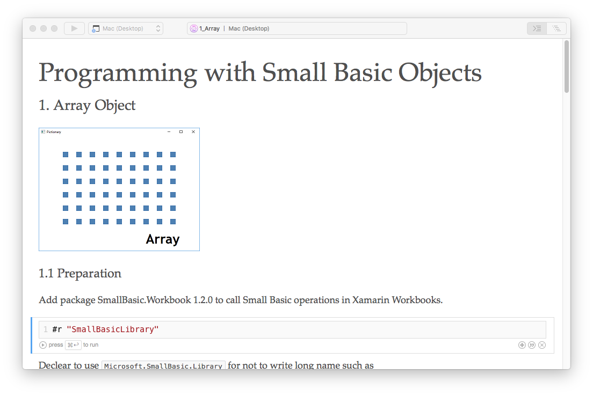
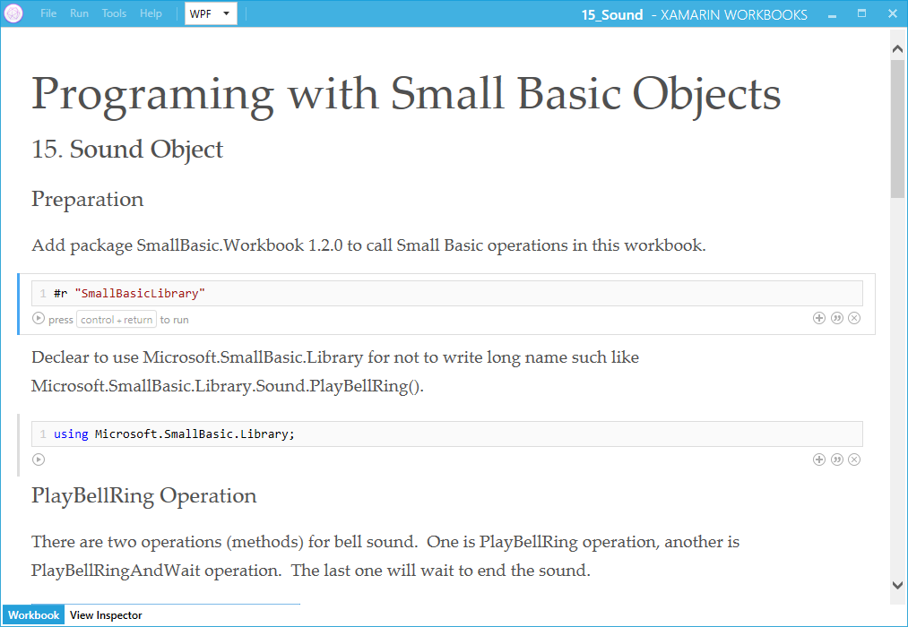

# Xamarin Workbooks: Small Basic オブジェクトでプログラミング
この zip ファイルには 20 の Xamarin Workbooks で Small Basic オブジェクトについて学ぶための workbook フォルダが格納される予定です。現在はそのうちの4個が格納されています。これらの workbooks で 20 の Small Basic オブジェクトの（サンプルコードとして）使い方をカバーします。いくつかの workbook は Mac と Windows の双方で動作します。 

**ダウンロード**: [Workbooks.zip](https://github.com/nonkit/SBResources/raw/master/xamarin/Workbooks.zip)

- ダウンロード済み: 59 回
- カテゴリ: アプリケーション
- サブカテゴリ: クライアント アプリケーション
- 翻訳: [English](README)
- タグ: C#, Small Basic, Xamarin Workbooks
- 最終更新日: 2017/09/27
- ライセンス: [MIT](/LICENSE)

## 説明

この zip ファイルには 20 の Xamarin Workbooks で Small Basic オブジェクトについて学ぶための workbook フォルダが格納される予定です。現在はそのうちの4個が格納されています。これらの workbooks で 20 の Small Basic オブジェクトの（サンプルコードとして）使い方をカバーします。いくつかの workbook は Mac と Windows の双方で動作します。 一部の workbook は Windows でのみ動作します。

## 使い方
1. [Xamarin Workbooks](https://developer.xamarin.com/workbooks/) をインストールします。
2. Workbooks.zip をこのページからダウンロードします。 
3. Workbooks.zip を解凍します。 
4. Xamarin Workbooks を起動します。 
5. 解凍した workbook フォルダを開きます。 

## 提供範囲
| # | オブジェクト | Mac | Windows |
| --- | --- | --- | --- |
| 1 | Array | ✔ | ✔ |
| 2 | Clock | ✔ | ✔ |
| 3 | Controls |  | ✔ |
| 4 | Desktop |  |  |
| 5 | Dictionary |  |
| 6 | File |  |  |
| 7 | Flickr |  |  |
| 8 | GraphicsWindow |  |  |
| 9 | ImageList |  |  |
| 10 | Math |  |  |
| 11 | Mouse |  |  |
| 12 | NetWork |  |  |
| 13 | Program |  |  |
| 14 | Shapes |  |  |
| 15 | Sound |  | ✔ |
| 16 | Stack | ✔ | ✔ |
| 17 | Text |  |  |
| 18 | TextWindow |  |  |
| 19 | Timer |  | ✔ |
| 20 | Turtle |  |  |
 
## 既知の問題
1. Xamarin Workbooks 上で Sound.PlayXXX() メソッドが他のメソッドの音を鳴らすことがある。
2. Xamarin Workbooks で workbook を保存すると Horizontal Rule（水平方向の罫線）以降の内容が表示されなくなる。

## 関連項目
- [Small Basic: Sample Code](https://social.technet.microsoft.com/wiki/contents/articles/34917.small-basic-sample-code.aspx) (TechNet Wiki 英語)
- [SmallBasic.Workbook 1.2.0: Known Issues](https://social.technet.microsoft.com/wiki/contents/articles/40092.smallbasic-workbook-1-2-0-known-issues.aspx) (TechNet Wiki 英語)

**次のプラットフォームで検証済み**

| プラットフォーム | 結果 |
| --- | --- |
| Windows 10 | 適 |
| Windows Server 2012 | 不適 |
| Windows Server 2012 R2 | 不適 |
| Windows Server 2008 R2 | 不適 |
| Windows Server 2008 | 不適 |
| Windows Server 2003 | 不適 |
| Windows Server 2016 | 不適 |
| Windows 8 | 不適 |
| Windows 7 | 不適 |
| Windows Vista | 不適 |
| Windows XP | 不適 |
| Windows 2000 | 不適 |

本スクリプトは作成者によってこれらのプラットフォームでテストされます。また他のプラットフォームでもテストされるものと思われます。実際にお試しになり他のプラットフォームで動作することを確認された場合は、本スクリプトに関するディスカッションにコメントを追加し、他のユーザーにお知らせください。